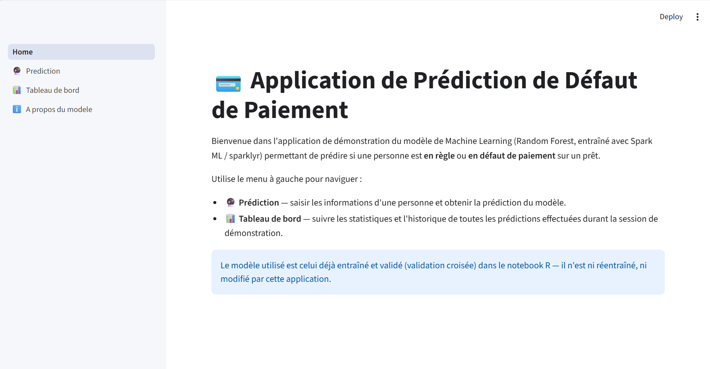
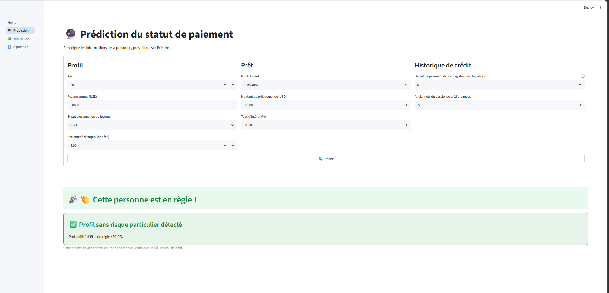
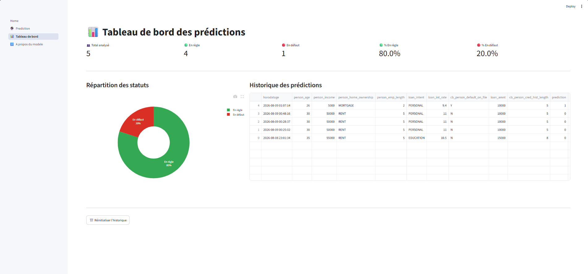

# 💳 Application de Prédiction de Défaut de Paiement

Application web de scoring crédit développée avec **Streamlit**, s'appuyant
sur un modèle **Random Forest** entraîné et validé via **Spark ML**
(`sparklyr`) pour prédire le risque de défaut de paiement d'un client, avec
suivi en temps réel des analyses effectuées.


## 📸 Aperçu

| Accueil | Prédiction |
|---|---|
|  |  |

| Tableau de bord |
|---|
|  |

## 🎯 Fonctionnalités

- **🔮 Prédiction** — formulaire de saisie, prédiction en temps réel,
  affichage visuel distinct selon le résultat (validation avec notification
  discrète si le client est en règle, alerte rouge avec niveau de risque
  s'il est en défaut).
- **📊 Tableau de bord** — indicateurs clés, répartition graphique, et
  historique complet des prédictions, mis à jour automatiquement.
- **ℹ️ À propos du modèle** — méthodologie, hyperparamètres retenus et
  métriques de performance du modèle, générées dynamiquement à partir de
  l'entraînement R.

## 🏗️ Architecture

```
                    ┌─────────────────────────┐
                    │   Notebook R (sparklyr)  │
                    │  Entraînement + validation│
                    │   croisée du pipeline    │
                    └────────────┬─────────────┘
                                 │ ml_save()
                                 ▼
                    ┌─────────────────────────┐
                    │  modele_credit_risk_spark│
                    │   (CrossValidatorModel)  │
                    └────────────┬─────────────┘
                                 │ CrossValidatorModel.load()
                                 ▼
        ┌────────────────────────────────────────────┐
        │             Application Streamlit            │
        │  ┌──────────┐  ┌──────────┐  ┌────────────┐ │
        │  │Prédiction│→ │ Historique│→ │Tableau de  │ │
        │  │ (PySpark)│  │   (CSV)   │  │   bord     │ │
        │  └──────────┘  └──────────┘  └────────────┘ │
        └────────────────────────────────────────────┘
```

Le modèle est entraîné et validé **indépendamment** de l'application (en R,
via `sparklyr`) ; l'application se charge uniquement du déploiement, de
l'interface utilisateur et du suivi des prédictions — elle ne réentraîne ni
ne modifie la logique du modèle.

## 📊 Performance du modèle

| Métrique | Valeur |
|---|---|
| AUC (ROC) | 0.8959 |
| Accuracy | 0.8936 |
| Précision | 0.8928 |
| Rappel | 0.8936 |

Modèle : Random Forest, validation croisée à 5 folds, meilleurs
hyperparamètres retenus : 100 arbres, profondeur maximale 10, critère
d'impureté *entropy*. Détails complets et méthodologie disponibles dans la
page **ℹ️ À propos du modèle** de l'application.

## 📁 Structure du projet

```
credit_risk_app/
├── modele_credit_risk_spark/    # Modèle Spark ML entraîné (CrossValidatorModel)
├── metrics_modele.json          # Métriques de performance (générées depuis R)
├── pages/
│   ├── 1_🔮_Prediction.py
│   ├── 2_📊_Tableau_de_bord.py
│   └── 3_ℹ️_A_propos_du_modele.py
├── utils/
│   ├── model_loader.py          # Chargement du modèle + prédiction
│   └── history.py               # Gestion de l'historique
├── data/
│   └── predictions_history.csv
├── .streamlit/
│   └── config.toml
├── Home.py
└── requirements.txt
```

## ⚙️ Installation

**Prérequis :** Python 3.10, Java 8 ou 11 (nécessaire pour PySpark).

```bash
git clone https://github.com/sokhna20-ndeye/credit-risk-streamlit-app.git
cd credit-risk-streamlit-app

python -m venv venv
venv\Scripts\activate          # Windows
# source venv/bin/activate     # macOS / Linux

pip install -r requirements.txt
```

## ▶️ Lancer l'application

```bash
streamlit run Home.py
```

L'application s'ouvre sur `http://localhost:8501`. La toute première
prédiction peut prendre 10 à 30 secondes (démarrage de la session Spark
locale) ; les suivantes sont quasi instantanées.

## 🧠 Méthodologie du modèle (résumé)

Pipeline Spark ML :
1. Imputation des valeurs manquantes (médiane)
2. Indexation et encodage one-hot des variables catégorielles
3. Assemblage des variables explicatives (`VectorAssembler`)
4. Standardisation (`StandardScaler`)
5. Classification par Random Forest, optimisée par validation croisée
   (grille sur le nombre d'arbres, la profondeur maximale et le critère
   d'impureté)

Jeu de données : [Credit Risk Dataset](https://www.kaggle.com/datasets/laotse/credit-risk-dataset),
26 013 observations d'entraînement, 6 568 observations de test.

## 👤 Auteur

Projet réalisé dans le cadre du cursus Statistique et Informatique
Décisionnelle — EMIA, Dakar.